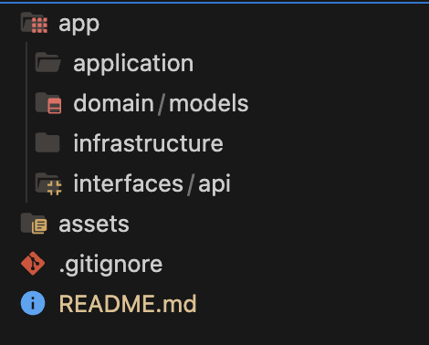

# Hệ Thống Chẩn Đoán Bệnh Về Da

Hệ thống AI hỗ trợ chẩn đoán bệnh về da thông qua hình ảnh và mô tả triệu chứng

## Tính Năng

- 🖼️ **Phân tích hình ảnh da liễu**: Xử lý và phân tích hình ảnh vùng da tổn thương để nhận diện các dấu hiệu bệnh lý.
- 📝 **Kết hợp mô tả triệu chứng**: Hỗ trợ người dùng nhập mô tả triệu chứng để nâng cao độ chính xác của chẩn đoán.
- 🧩 **Kiến trúc mở rộng**: Sử dụng Clean Architecture để tách biệt rõ ràng các tầng và luồng xử lý.
- 🚀 **Tối ưu AI Pipeline**: Tích hợp các mô hình AI tiên tiến như ViT, CLIP, MM-RAG để phân tích và đưa ra chẩn đoán chính xác.
- 🧬 **Tìm kiếm và tham chiếu y khoa**: Kết nối cơ sở dữ liệu y khoa để xác thực và tham chiếu các bệnh lý có liên quan.

## Ứng Dụng

- Hỗ trợ bác sĩ trong việc chẩn đoán sơ bộ các bệnh da.
- Cung cấp hệ thống tự động cho các ứng dụng y tế cá nhân.
- Nền tảng nghiên cứu và phát triển AI trong y tế.

## Công Nghệ Sử Dụng

- **Ngôn ngữ lập trình**: Python, FastAPI
- **Kiến trúc**: Clean Architecture / Hexagonal Architecture
- **Lưu trữ và Xử lý Dữ liệu**: Google Cloud Storage, FAISS Vector Search, MongoDB
- **Mô hình AI**: ViT, CLIP, MM-RAG, BLIP-2
- **Công cụ**: FastAPI, PyTorch, Transformers, FAISS, Google Cloud Storage

## Kiến Trúc Hệ Thống

```
[User] 
   │
   ▼
[API Layer: FastAPI]  
   │
   ▼
[Application Layer: Use Cases]
   │
   ├── [Domain Layer: Entities / Models]
   │
   └── [Infrastructure Layer: AI Services, Database, Storage]
```

## Cấu Trúc Thư Mục


## Mô Tả Các Thành Phần Chính Trong Kiến Trúc

1. **Domain Layer**  
   Tầng này chứa các **Entity** và **Value Object** mô tả các khái niệm cốt lõi của hệ thống như "Bệnh da", "Hình ảnh da", và "Chẩn đoán". Đây là nơi định nghĩa các luật và quy tắc liên quan đến xử lý bệnh.

   - Ví dụ: Định nghĩa các Entity cho "Bệnh da", "Hình ảnh da", "Kết quả chẩn đoán", và các giá trị liên quan.

2. **Application Layer (Use Case)**  
   Tầng này chứa các **Use Case** hoặc luồng xử lý chính của hệ thống, nơi các yêu cầu từ người dùng được xử lý. Ví dụ, khi người dùng tải lên một hình ảnh, hệ thống sẽ xử lý ảnh, phân tích và đưa ra kết quả chẩn đoán.

   - Ví dụ: `diagnose_skin_disease_use_case.py` sẽ thực hiện các bước từ tiền xử lý ảnh, phân tích bằng mô hình AI cho đến việc trả về kết quả.

3. **Infrastructure Layer (Kết nối với các dịch vụ ngoài)**  
   Tầng này kết nối với các công cụ, thư viện bên ngoài như **AI Models**, **Database**, và **Cloud Storage**. Các phần này không chứa logic nghiệp vụ, mà chỉ là các lớp phụ trợ cho hệ thống.

   - Ví dụ:
     - Lưu ảnh lên **Google Cloud Storage**.
     - Gọi các mô hình AI như **ViT**, **CLIP**, **MM-RAG**.
     - Kết nối **MongoDB** để lưu trữ thông tin bệnh lý.

4. **Interface Layer (API / CLI)**  
   Đây là tầng giao tiếp giữa người dùng và hệ thống. API được xây dựng bằng **FastAPI**, cho phép người dùng tải lên ảnh và nhận kết quả chẩn đoán. Cũng có thể mở rộng giao diện này để sử dụng qua CLI hoặc Web.

   - Ví dụ: API **FastAPI** sẽ nhận ảnh từ người dùng và trả kết quả chẩn đoán.

## Hướng Dẫn Sử Dụng

1. **Clone repository** về máy:
   ```bash
   git clone https://github.com/ThuPham60232004/py_mediSys.git
   ```

2. **Cài đặt các thư viện cần thiết**:
   ```bash
   pip install -r requirements.txt
   ```

3. **Thêm ảnh da liễu vào thư mục `input/`**.

4. **Khởi chạy server**:
   ```bash
   uvicorn app.interfaces.api.main:app --reload
   ```

5. **Gửi yêu cầu dự đoán qua API** hoặc giao diện.

   - Gửi yêu cầu **POST** tới API `/upload_image/` với hình ảnh da.
   - Nhận kết quả chẩn đoán, giải thích chi tiết về bệnh da.

## Đóng Góp

Chúng tôi luôn hoan nghênh đóng góp từ cộng đồng! Nếu bạn muốn tham gia xây dựng và cải tiến hệ thống này, vui lòng mở **issue** hoặc **pull request**.

Các bước đóng góp:

1. Fork repository về tài khoản của bạn.
2. Tạo nhánh mới cho tính năng hoặc sửa lỗi.
3. Tạo pull request với mô tả chi tiết về thay đổi.
4. Chờ sự xem xét và phản hồi từ nhóm phát triển.
