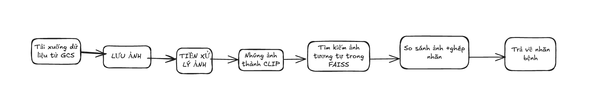

## ersion: `release/v1-testing`

###  **V1 - Pipeline chẩn đoán da liễu bằng ảnh**

---

### **Quy trình xử lý (Pipeline)**

---

### **Chi tiết từng bước**

| Bước                      | Mô tả                                                                          |
| ------------------------- | ------------------------------------------------------------------------------ |
| **1. Thêm ảnh**           | Người dùng chọn ảnh da liễu qua giao diện web hoặc API                         |
| **2. Upload GCS**         | Ảnh được tải lên Google Cloud Storage để lưu trữ                               |
| **3. Tiền xử lý**         | Resize, normalize ảnh trước khi đưa vào mô hình                                |
| **4. Vector hóa ảnh**     | Sử dụng mô hình CLIP để chuyển ảnh thành embedding vector                      |
| **5. Tìm ảnh tương đồng** | Dùng FAISS để tìm k ảnh gần nhất trong cơ sở dữ liệu đã có                     |
| **6. Gán nhãn**           | Nhãn bệnh được gán dựa trên ảnh gần nhất                                       |

---

### **Ưu điểm V1**

* **Triển khai nhanh**: Hệ thống đơn giản, chỉ cần embedding + FAISS
* **Không cần huấn luyện mô hình mới**: Dựa trên các vector đã có
* **Dễ mở rộng**: Có thể cập nhật thêm ảnh vào FAISS mà không retrain
* **Tốc độ xử lý nhanh**: Truy vấn ảnh gần nhất chỉ mất vài mili giây
---

### **Nhược điểm V1**

* **Không xử lý tốt ảnh không rõ nét hoặc quá khác biệt**
* **Chưa phát hiện ảnh bất thường (anomaly/outlier)**
* **Gán nhãn cứng**: Chỉ dựa vào ảnh gần nhất, không có logic kiểm chứng sâu
* **Độ chính xác phụ thuộc dữ liệu trong FAISS**
* **Không cung cấp lý do rõ ràng cho quyết định** *(→ được cải thiện ở V2 với MMRAG)*

