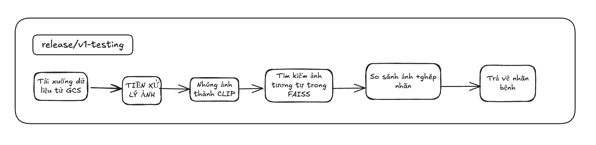

## Version: `release/v1-testing`

###  **V1 - Pipeline chẩn đoán da liễu bằng ảnh**

---

### **Quy trình xử lý (Pipeline)**

---

### **Chi tiết từng bước**

| Bước                      | Mô tả                                                                          |
| ------------------------- | ------------------------------------------------------------------------------ |
| **1. Thêm ảnh**           | Người dùng chọn ảnh da liễu qua giao diện web hoặc API                         |
| **2. Upload GCS**         | Ảnh được tải lên Google Cloud Storage để lưu trữ                               |
| **3. Tiền xử lý**         | Resize, normalize ảnh trước khi đưa vào mô hình                                |
| **4. Vector hóa ảnh**     | Sử dụng mô hình CLIP để chuyển ảnh thành embedding vector                      |
| **5. Tìm ảnh tương đồng** | Dùng FAISS để tìm k ảnh gần nhất trong cơ sở dữ liệu đã có                     |
| **6. Gán nhãn**           | Nhãn bệnh được gán dựa trên ảnh gần nhất                                       |
| **7. Trả về nhãn chính xác nhất**           | Dùng FAISS quyết định nhãn chính xác nhất                                       |
---

### **Ưu điểm V1**

* **Triển khai nhanh**: Hệ thống đơn giản, chỉ cần embedding + FAISS
* **Không cần huấn luyện mô hình mới**: Dựa trên các vector đã có
* **Dễ mở rộng**: Có thể cập nhật thêm ảnh vào FAISS mà không retrain
* **Tốc độ xử lý nhanh**: Truy vấn ảnh gần nhất chỉ mất vài mili giây
---

### **Nhược điểm V1**

* **Không xử lý tốt ảnh không rõ nét hoặc quá khác biệt**
* **Chưa phát hiện ảnh bất thường (anomaly/outlier)**
* **Gán nhãn cứng**: Chỉ dựa vào ảnh gần nhất, không có logic kiểm chứng sâu
* **Độ chính xác phụ thuộc dữ liệu trong FAISS**
* **Không cung cấp lý do rõ ràng cho quyết định**
---

## Nhược điểm của V1

1. **Không xử lý tốt ảnh không rõ nét hoặc quá khác biệt**

   * V1 thiếu các bước tiền xử lý ảnh nâng cao như cân bằng sáng, làm mờ, phát hiện cạnh, nên dễ bị ảnh hưởng bởi chất lượng ảnh đầu vào kém, dẫn đến embedding không chính xác.

2. **Chưa phát hiện được ảnh bất thường (anomaly/outlier)**

   * V1 chỉ so sánh vector tổng thể của ảnh mà không tách riêng vùng bất thường, nên bỏ sót các dấu hiệu bệnh lý tinh vi hoặc không phát hiện được những trường hợp ảnh lạ, bất thường.

3. **Gán nhãn cứng, chỉ dựa vào ảnh gần nhất, không có logic kiểm chứng sâu**

   * V1 chỉ dựa vào ảnh tương tự nhất để gán nhãn, không kết hợp nhiều kết quả để đánh giá tần suất nhãn, thiếu cơ chế chọn nhãn chính xác hơn.

4. **Độ chính xác phụ thuộc rất nhiều vào dữ liệu trong FAISS**

   * Nếu dữ liệu trong FAISS chưa đầy đủ hoặc có nhiễu, việc tìm ảnh tương tự và gán nhãn dễ bị sai lệch.

5. **Không cung cấp lý do rõ ràng cho quyết định chuẩn đoán**

   * V1 không có bước giải thích hay xác nhận kết quả, gây khó khăn cho việc kiểm chứng và tin tưởng kết quả của hệ thống.
