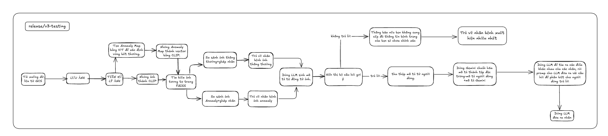

## Version: `release/v3-testing`

###  **V3 - Pipeline chẩn đoán da liễu bằng ảnh**

---

### **Quy trình xử lý (Pipeline)**

---

### **Chi tiết từng bước**

Dưới đây là bảng chi tiết đầy đủ các bước của **V3** theo yêu cầu, viết đầy đủ, rõ ràng và mạch lạc:

| Bước                                  | Mô tả                                                                                                                                                                                                                 |
| ------------------------------------- | --------------------------------------------------------------------------------------------------------------------------------------------------------------------------------------------------------------------- |
| **1. Thêm ảnh**                       | Người dùng chọn ảnh da liễu qua giao diện web hoặc API.                                                                                                                                                               |
| **2. Upload GCS**                     | Ảnh được tải lên Google Cloud Storage để lưu trữ tạm thời.                                                                                                                                                            |
| **3. Tiền xử lý ảnh**                 | Thực hiện cân bằng sáng, làm mờ (blur), phát hiện cạnh trên ảnh để chuẩn bị cho bước tiếp theo.                                                                                                                       |
| **4. Tạo Anomaly Map**                | Sử dụng mô hình ViT (Vision Transformer) để tạo bản đồ bất thường (anomaly map) dưới dạng ảnh nhiệt, phát hiện vùng tổn thương hoặc khác biệt.                                                                        |
| **5. Nhúng ảnh gốc & anomaly map**    | Dùng CLIP để chuyển ảnh gốc và anomaly map thành các vector đặc trưng (embedding), biểu diễn thông tin phong phú, giúp tìm kiếm và phân loại chính xác hơn.                                                           |
| **6. Tải các FAISS index & labels**   | Tải 3 loại FAISS index: ảnh thường (`faiss_normal.index`), anomaly map (`faiss_anomaly.index`), và mô tả văn bản (`faiss_text.index` - tùy chọn). Đồng thời tải nhãn tương ứng: `labels.npy` và `labels_anomaly.npy`. |
| **7. Tìm kiếm ảnh tương tự**          | Dùng FAISS tìm kiếm ảnh gần nhất trong index ảnh thường từ vector ảnh gốc, và tìm kiếm trong index anomaly từ vector anomaly map.                                                                                     |
| **8. Gộp và phân tích nhãn bệnh**     | Ghép nhãn bệnh từ kết quả tìm kiếm của cả hai FAISS index. Thống kê tần suất xuất hiện của các nhãn, chọn nhãn bệnh có tần suất cao nhất làm nhãn chính xác.                                                          |
| **9. Sinh mô tả tự động từ ảnh**      | Dùng mô hình Gemini để sinh mô tả tự động từ ảnh, tạo thêm ngữ cảnh, đặc điểm liên quan đến bệnh lý nhằm hỗ trợ chẩn đoán.                                                                                            |
| **10. Thu thập mô tả từ người dùng**  | Hiển thị bộ câu hỏi gợi ý dựa trên mô tả tự động, thu thập mô tả bổ sung trực tiếp từ người dùng để tăng tính cá nhân hóa và chính xác.                                                                               |
| **11. Chuẩn hóa mô tả**               | Dùng Gemini chuẩn hóa và kết hợp mô tả người dùng với mô tả tự động thành một tập đặc trưng đồng nhất, dễ xử lý cho các bước tiếp theo.                                                                               |
| **12. Phân tích điểm khác biệt nhãn** | Sử dụng LLM để phân tích các điểm khác nhau giữa các nhãn bệnh thu được, rồi prompt Gemini tạo ra các câu hỏi phân biệt, giúp người dùng trả lời để xác định chính xác hơn.                                           |
| **13. Dự đoán nhãn cuối cùng**        | Dựa trên các câu trả lời và phân tích từ Gemini, đưa ra nhãn bệnh cuối cùng cùng với lời giải thích và các điểm đặc trưng phân biệt nhãn.                                                                             |

---

## Ưu điểm chi tiết của phiên bản V3

1. **Tăng độ chính xác chẩn đoán đa chiều**

   * V3 không chỉ dựa vào đặc trưng ảnh và anomaly map mà còn kết hợp thêm mô tả tự động do Gemini sinh ra và mô tả do người dùng cung cấp.
   * Việc tổng hợp cả thông tin hình ảnh và ngôn ngữ giúp nhận diện bệnh chính xác hơn, nhất là trong các trường hợp mẫu ảnh tương tự trên FAISS còn hạn chế hoặc bệnh lý phức tạp.

2. **Tương tác người dùng nâng cao chất lượng dữ liệu đầu vào**

   * Bộ câu hỏi gợi ý giúp người dùng cung cấp các thông tin liên quan, triệu chứng hoặc đặc điểm bệnh lý mà ảnh không thể thể hiện đầy đủ.
   * Điều này làm phong phú thêm tập dữ liệu, cải thiện khả năng phân biệt các nhãn bệnh tương tự.

3. **Khả năng phân biệt nhãn bệnh gần giống thông minh hơn**

   * Nhờ LLM phân tích sự khác biệt giữa các nhãn và Gemini tự động tạo ra các câu hỏi phân biệt cho người dùng trả lời, hệ thống có thể loại trừ nhãn bệnh sai hoặc không chính xác.
   * Giúp nâng cao tỷ lệ đúng nhãn trong những trường hợp nhạy cảm hoặc khó phân biệt.

4. **Giải thích và minh bạch chẩn đoán**

   * Gemini cung cấp các mô tả tự nhiên, câu hỏi và phân tích giúp người dùng dễ hiểu và tin tưởng kết quả chẩn đoán.
   * Tính năng này tăng tính tương tác và trải nghiệm người dùng, đặc biệt quan trọng trong y tế.

5. **Cơ sở dữ liệu mô tả ngày càng mở rộng**

   * Việc thu thập mô tả người dùng qua bộ câu hỏi giúp hệ thống có dữ liệu ngôn ngữ thực tế, hỗ trợ đào tạo và nâng cấp mô hình ngôn ngữ trong tương lai.
   * Giúp hệ thống ngày càng thông minh, linh hoạt hơn theo thời gian.

---

## Nhược điểm chi tiết của phiên bản V3

1. **Phức tạp về quy trình và kiến trúc hệ thống**

   * V3 tích hợp nhiều thành phần AI (ViT, CLIP, FAISS, Gemini, LLM) với nhiều bước xử lý, điều phối dữ liệu phức tạp hơn V2.
   * Điều này gây khó khăn cho việc phát triển, bảo trì và xử lý lỗi hệ thống.

2. **Tốn thời gian xử lý và phản hồi**

   * Việc sinh mô tả tự động, tương tác với người dùng qua bộ câu hỏi và xử lý LLM làm tăng độ trễ, khiến thời gian trả kết quả lâu hơn so với V2.
   * Gây giảm trải nghiệm người dùng nếu không được tối ưu tốt.

3. **Yêu cầu tài nguyên tính toán lớn hơn**

   * Sử dụng các mô hình LLM và Gemini đòi hỏi GPU mạnh, bộ nhớ lớn và hạ tầng phức tạp.
   * Chi phí vận hành và triển khai cao hơn đáng kể.

4. **Phụ thuộc nhiều vào chất lượng câu hỏi và tương tác người dùng**

   * Nếu bộ câu hỏi không phù hợp hoặc người dùng cung cấp thông tin không chính xác, hiệu quả phân biệt nhãn bệnh có thể giảm.
   * Cần UI/UX thiết kế thật tốt để đảm bảo người dùng dễ dàng hiểu và trả lời đúng.

5. **Khó khăn trong việc kiểm soát và giải thích quyết định LLM**

   * Mặc dù Gemini giúp giải thích nhưng các quyết định dựa trên mô hình ngôn ngữ vẫn có thể thiếu minh bạch hoặc gây nhầm lẫn nếu không được thiết kế kỹ.

---

## Lý do cập nhật từ V2 sang V3

1. **Giải quyết hạn chế về độ chính xác chẩn đoán chỉ dựa trên ảnh**

   * V2 dựa hoàn toàn vào đặc trưng ảnh và embedding FAISS, dễ sai lệch khi ảnh không đủ đặc trưng hoặc bệnh có biểu hiện gần giống.
   * V3 bổ sung thông tin mô tả (tự động + người dùng) để chẩn đoán đa chiều, tăng độ chính xác.

2. **Nâng cao trải nghiệm và sự tương tác của người dùng**

   * Người dùng không còn là “người thụ động” mà được hỏi thêm thông tin giúp chẩn đoán sát thực tế hơn, tăng tính cá nhân hóa.
   * Giúp người dùng hiểu rõ tình trạng bệnh qua phần mô tả, câu hỏi và giải thích từ Gemini.

3. **Tăng tính minh bạch và giải thích được kết quả chẩn đoán**

   * Trong y tế, kết quả cần phải minh bạch để được tin tưởng. V3 tạo ra các mô tả, câu hỏi và lời giải thích từ mô hình ngôn ngữ giúp làm rõ lý do chọn nhãn bệnh.

4. **Hỗ trợ hệ thống học tập và cải tiến liên tục**

   * Thu thập mô tả người dùng qua bộ câu hỏi giúp tạo dữ liệu ngôn ngữ thực tế, làm cơ sở để nâng cấp, tinh chỉnh mô hình LLM/Gemini trong tương lai.
   * Tạo một vòng feedback (phản hồi) từ người dùng đến hệ thống, giúp nâng cao chất lượng chẩn đoán theo thời gian.

5. **Tận dụng sức mạnh của các mô hình LLM/Gemini mới**

   * V3 khai thác khả năng xử lý ngôn ngữ tự nhiên tiên tiến của Gemini, từ đó cải thiện đáng kể khả năng phân biệt nhãn bệnh, đặc biệt với những trường hợp phức tạp hoặc mới.

---

## **Lý do nên nâng cấp từ V2 → V3**

| Tiêu chí                       | V3                                                                                                    | Ưu điểm                                                                         | Nhược điểm                                                                | Lý do nâng cấp từ V2 sang V3                                  |
| ------------------------------ | ----------------------------------------------------------------------------------------------------- | ------------------------------------------------------------------------------- | ------------------------------------------------------------------------- | ------------------------------------------------------------- |
| **Tiếp nhận & lưu ảnh**        | Nhận ảnh, lưu tạm trên GCS                                                                            | Tương tự V2, ổn định, có lưu trữ tạm                                            | -                                                                         | Giữ nguyên mô hình lưu trữ ảnh, đảm bảo quản lý file hiệu quả |
| **Tiền xử lý ảnh**             | Cân bằng sáng, làm mờ, phát hiện cạnh                                                                 | Cải thiện chất lượng ảnh đầu vào, chuẩn hóa dữ liệu                             | Tăng độ phức tạp trong pipeline                                           | Giữ nguyên để đảm bảo ảnh tốt cho bước tiếp theo              |
| **Tạo Anomaly Map**            | Tạo anomaly map bằng ViT                                                                              | Phát hiện vùng bất thường chi tiết hơn                                          | Chi phí tính toán cao hơn so với V1                                       | Giữ nguyên để nâng cao độ chính xác                           |
| **Nhúng ảnh (embedding)**      | Nhúng ảnh gốc + anomaly map bằng CLIP                                                                 | Tăng độ đặc trưng, tăng khả năng nhận diện                                      | -                                                                         | Giữ nguyên để đảm bảo vector embedding chất lượng             |
| **Tải FAISS index & labels**   | Tải index cho ảnh thường, ảnh anomaly, text                                                           | Đa dạng dữ liệu cho việc tìm kiếm tương tự                                      | Quản lý nhiều index phức tạp hơn                                          | Giữ nguyên, làm nền tảng cho phần phân loại đa nguồn          |
| **Tìm kiếm ảnh tương tự**      | Tìm trên cả ảnh thường và ảnh anomaly                                                                 | Kết quả tìm kiếm đa chiều, tăng độ chính xác                                    | -                                                                         | Giữ nguyên, giúp cải thiện độ chính xác                       |
| **Ghép nhãn bệnh**             | Ghép nhãn từ labels thường và anomaly, chọn nhãn theo tần suất                                        | Tăng tính chính xác khi nhiều nhãn khớp                                         | Có thể chậm hơn do xử lý nhiều nhãn                                       | Giữ nguyên để nâng cao độ tin cậy của phân loại               |
| **Sinh mô tả tự động từ ảnh**  | Dùng Gemini để sinh mô tả tự động                                                                     | Giúp tạo thêm ngữ cảnh mô tả bệnh, hỗ trợ chuẩn đoán, giảm phụ thuộc người dùng | Tốn tài nguyên tính toán, có thể sai lệch nhẹ nếu mô hình chưa hoàn thiện | Tăng khả năng giải thích và tương tác AI                      |
| **Thu thập mô tả người dùng**  | Hiển thị bộ câu hỏi gợi ý để thu thập mô tả từ người dùng                                             | Thu thập dữ liệu trực tiếp, giúp cá nhân hóa và làm rõ đặc điểm bệnh            | Phụ thuộc vào sự hợp tác và chất lượng câu trả lời của người dùng         | Tăng khả năng cá nhân hóa, nâng cao độ chính xác chẩn đoán    |
| **Chuẩn hóa mô tả**            | Dùng Gemini chuẩn hóa mô tả người dùng + mô tả tự động thành đặc trưng                                | Tích hợp dữ liệu đa chiều, dễ xử lý cho các bước tiếp theo                      | Độ phức tạp cao, cần đảm bảo chất lượng mô hình Gemini                    | Nâng cao chất lượng dữ liệu đầu vào cho LLM                   |
| **Phân tích khác biệt nhãn**   | Dùng LLM tìm điểm khác biệt giữa các nhãn, prompt Gemini tạo câu hỏi phân biệt cho người dùng trả lời | Giúp xác định chính xác hơn nhãn bệnh, giảm nhầm lẫn                            | Tốn thời gian tương tác, tăng độ phức tạp hệ thống                        | Tăng độ chính xác phân biệt các bệnh gần giống                |
| **Trả về nhãn bệnh cuối cùng** | Dùng Gemini tổng hợp, ưu nhược điểm các nhãn rồi đưa ra nhãn bệnh cuối cùng                           | Giải thích rõ ràng, minh bạch, tăng tin cậy với người dùng và bác sĩ            | Thời gian xử lý có thể lâu hơn do nhiều bước tương tác                    | Tăng khả năng giải thích và minh bạch cho kết quả chẩn đoán   |

---

### Tóm tắt lý do update từ V2 sang V3:

* **Tăng cường khả năng giải thích, tương tác:** Thêm bước sinh mô tả tự động, hỏi người dùng để tăng tính cá nhân hóa và giải thích rõ hơn cho kết quả.
* **Nâng cao độ chính xác chẩn đoán:** Kết hợp dữ liệu mô tả người dùng và tự động, dùng LLM & Gemini để phân biệt nhãn gần giống.
* **Minh bạch và tin cậy hơn:** Kết quả cuối cùng được tổng hợp và giải thích chi tiết, giúp người dùng và chuyên gia y tế dễ dàng tin tưởng.
* **Phát triển hệ thống AI phức tạp, hiện đại:** Chuẩn hóa mô tả, dùng LLM, tạo câu hỏi phân biệt, mở ra tiềm năng tích hợp thêm nhiều mô hình và dữ liệu trong tương lai.

