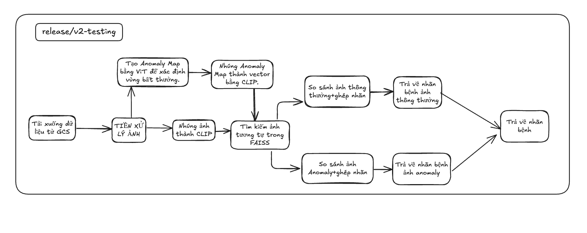

## Version: `release/v2-testing`

###  **V2 - Pipeline chẩn đoán da liễu bằng ảnh**

---

### **Quy trình xử lý (Pipeline)**

---

### **Chi tiết từng bước**

| Bước                      | Mô tả                                                                          |
| ------------------------- | ------------------------------------------------------------------------------ |
| **1. Thêm ảnh**           | Người dùng chọn ảnh da liễu qua giao diện web hoặc API                         |
| **2. Upload GCS**         | Ảnh được tải lên Google Cloud Storage để lưu trữ                               |
| **3. Tiền xử lý**         | Resize, normalize ảnh trước khi đưa vào mô hình                                |
| **4. Tạo Anomaly Map**     | Sử dụng mô hình ViT (Vision Transformer) để xác định vùng bất thường trong ảnh. Xuất ra bản đồ bất thường (anomaly map) dưới dạng ảnh nhiệt.                      |
| **5. Nhúng ảnh và anomaly map thành vector** | Sử dụng CLIP để chuyển ảnh gốc và anomaly map thành các vector đặc trưng. Vector biểu diễn giàu thông tin, giúp tìm kiếm chính xác hơn                     |
| **6. Tải FAISS index và nhãn tương ứng**           |    Gồm 3 loại index: `faiss_normal.index`: vector của ảnh bình thường, `faiss_anomaly.index`: vector của anomaly map, `faiss_text.index`: vector mô tả bệnh bằng văn bản *(tuỳ chọn). Các file nhãn tương ứng:`labels.npy`,`labels_anomaly.npy`                                       |
| **7. Tìm kiếm ảnh tương tự bằng FAISS**           | Tìm ảnh gần nhất trong: Index ảnh thường → từ vector ảnh gốc. Index anomaly → từ vector anomaly map                                       |
| **8. Gộp và phân tích nhãn bệnh**         | Trích xuất nhãn từ cả hai kết quả tìm kiếm. Thống kê tần suất xuất hiện của từng nhãn. Chọn nhãn xuất hiện nhiều nhất làm kết quả cuối cùng.                               |
| **9. Trả về chẩn đoán cuối cùng**         | Trả nhãn bệnh dự đoán cho người dùng                               |
---

## **Ưu điểm của V2**

1. **Tiền xử lý ảnh tốt hơn**

   * Cân bằng sáng, làm mờ, phát hiện cạnh giúp làm nổi bật đặc trưng ảnh, giảm nhiễu, xử lý tốt ảnh đầu vào chất lượng kém.

2. **Phát hiện vùng bất thường (Anomaly Map)**

   * Sử dụng Vision Transformer (ViT) để phát hiện chính xác các vùng nghi ngờ, thay vì chỉ xét toàn ảnh như V1.

3. **Kết hợp nhiều nguồn thông tin trong embedding**

   * Dùng CLIP để nhúng cả ảnh gốc và anomaly map → vector biểu diễn đa chiều, nắm bắt thông tin sâu hơn.

4. **Tìm kiếm tương đồng qua nhiều FAISS index**

   * Kết hợp cả ảnh thường và anomaly → tăng khả năng nhận diện bệnh trong nhiều trường hợp phức tạp.

5. **Gán nhãn mềm bằng thống kê tần suất**

   * Thay vì lấy ảnh gần nhất (như V1), V2 phân tích nhiều kết quả và chọn nhãn có tần suất cao nhất → giảm sai lệch.

6. **Tăng tính minh bạch**

   * Có thể hiển thị anomaly map để giải thích kết quả chẩn đoán cho người dùng hoặc bác sĩ kiểm chứng.

---

## **Nhược điểm của V2**

1. **Phức tạp hơn về kiến trúc và triển khai**

   * Nhiều bước hơn, cần thêm mô hình ViT và CLIP → yêu cầu tài nguyên tính toán và triển khai cao hơn.

2. **Tăng chi phí xử lý**

   * Phải xử lý anomaly map, nhúng nhiều vector, tìm kiếm FAISS nhiều lần → thời gian và tài nguyên tăng.

3. **Phụ thuộc vào chất lượng anomaly map**

   * Nếu mô hình ViT không được huấn luyện tốt, bản đồ bất thường có thể gây nhiễu thay vì hỗ trợ.

4. **Cần nhiều dữ liệu và quản lý chỉ mục FAISS phức tạp hơn**

   * Phải chuẩn bị FAISS index cho ảnh thường, anomaly, và cả văn bản nếu muốn mở rộng.

---

## **Lý do nên nâng cấp từ V1 → V2**

| Điểm yếu của V1                       | V2 cải thiện như thế nào                                        |
| ------------------------------------- | --------------------------------------------------------------- |
| Ảnh đầu vào mờ, nhiễu dễ sai kết quả  | Có bước tiền xử lý rõ ràng giúp chuẩn hóa ảnh                   |
| Không phát hiện ảnh bất thường        | Tạo anomaly map bằng ViT để tìm vùng nghi ngờ                   |
| Gán nhãn cứng từ 1 vector gần nhất    | Gán nhãn mềm bằng tần suất xuất hiện trong top K kết quả        |
| Phụ thuộc mạnh vào FAISS index đơn lẻ | Dùng nhiều FAISS index (thường + anomaly) → kết quả ổn định hơn |
| Không rõ lý do chẩn đoán              | Có thể minh hoạ bằng anomaly map để tăng tính tin cậy           |

---

## Tóm tắt

* **V1**: Đơn giản, dễ triển khai, nhưng thiếu khả năng xử lý ảnh phức tạp, dễ sai khi gặp ảnh lạ hoặc bất thường.
* **V2**: Phức tạp hơn nhưng đáng giá — độ chính xác cao hơn, có khả năng phát hiện vùng nghi ngờ, và logic gán nhãn hợp lý hơn.
