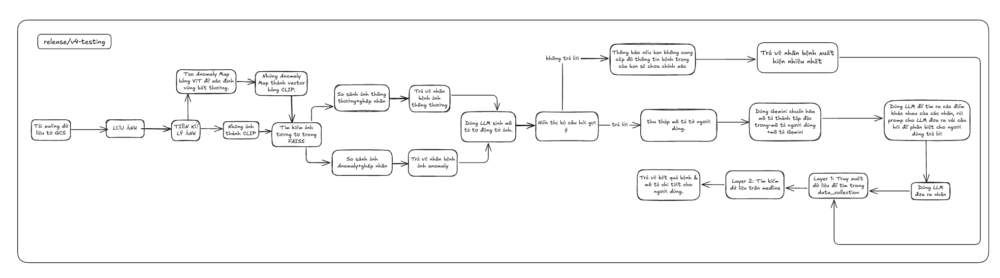

## Version: `release/v4-testing`

###  **V4 - Pipeline chẩn đoán da liễu bằng ảnh**

---

### **Quy trình xử lý (Pipeline)**

---

### **Chi tiết từng bước**

| Bước                                         | Mô tả                                                                                                                                                                                                                                                 |
| -------------------------------------------- | ----------------------------------------------------------------------------------------------------------------------------------------------------------------------------------------------------------------------------------------------------- |
| **1. Nhận ảnh từ người dùng**                | Người dùng chọn ảnh da liễu qua giao diện web hoặc API. Ảnh được lưu tạm thời lên Google Cloud Storage (GCS).                                                                                                                                         |
| **2. Tiền xử lý ảnh**                        | Thực hiện cân bằng sáng, làm mờ, phát hiện cạnh hoặc các bước tiền xử lý khác để chuẩn hóa ảnh trước khi đưa vào mô hình.                                                                                                                             |
| **3. Tạo Anomaly Map**                       | Sử dụng mô hình ViT (Vision Transformer) để phát hiện vùng bất thường trên ảnh da liễu. Xuất ra bản đồ bất thường (anomaly map) dưới dạng ảnh nhiệt thể hiện vùng bệnh lý.                                                                            |
| **4. Nhúng ảnh và anomaly map thành vector** | Dùng CLIP để chuyển ảnh gốc và anomaly map thành các vector đặc trưng (embedding). Vector này có ý nghĩa phong phú, giúp tìm kiếm ảnh tương tự chính xác hơn.                                                                                         |
| **5. Tải FAISS index và nhãn tương ứng**     | Tải ba loại FAISS index: `faiss_normal.index` (vector ảnh gốc bình thường), `faiss_anomaly.index` (vector anomaly map), `faiss_text.index` (embedding văn bản mô tả bệnh, tùy chọn). Tải nhãn tương ứng từ file `labels.npy` và `labels_anomaly.npy`. |
| **6. Tìm kiếm ảnh tương tự bằng FAISS**      | Tìm kiếm các ảnh gần nhất trên FAISS index của ảnh gốc và anomaly map, trả về nhãn bệnh tương ứng với các ảnh tìm được.                                                                                                                               |
| **7. Gộp và phân tích nhãn bệnh**            | Trích xuất nhãn bệnh từ kết quả tìm kiếm ảnh gốc và anomaly map. Thống kê tần suất xuất hiện của từng nhãn, chọn nhãn xuất hiện nhiều nhất làm kết quả sơ bộ.                                                                                         |
| **8. Sinh mô tả tự động từ ảnh (Gemini)**    | Dùng Gemini để tạo mô tả tự động dựa trên ảnh da liễu, hỗ trợ bổ sung thông tin chuẩn hóa mô tả bệnh.                                                                                                                                                 |
| **9. Thu thập mô tả bổ sung từ người dùng**  | Hiển thị bộ câu hỏi gợi ý dựa trên mô tả tự động, giúp người dùng trả lời bổ sung thông tin mô tả bệnh lý cụ thể hơn.                                                                                                                                 |
| **10. Chuẩn hóa mô tả và phân tích**         | Kết hợp mô tả người dùng và mô tả Gemini, chuẩn hóa thành tập đặc trưng mô tả bệnh.                                                                                                                                                                   |
| **11. Phân biệt nhãn dựa trên mô tả và LLM** | Dùng mô hình LLM để so sánh các nhãn bệnh, phân tích điểm khác nhau dựa trên mô tả tổng hợp, rồi dùng Gemini tạo ra các câu hỏi phân biệt cụ thể cho người dùng trả lời nhằm cải thiện độ chính xác chẩn đoán.                                        |
| **12. Loại trừ nhãn không phù hợp**          | Dựa trên câu trả lời của người dùng và mô tả chuẩn hóa, lọc bỏ các nhãn không phù hợp, giữ lại các nhãn bệnh có mức độ phù hợp cao.                                                                                                                   |
| **13. Truy xuất dữ liệu y khoa**             | Layer 1: Tìm dữ liệu trong bộ data\_collection có sẵn (dữ liệu cục bộ). Layer 2: Tìm kiếm dữ liệu tham khảo y khoa rộng hơn (Medline, PubMed).                                                                                                     |
| **14. Trả kết quả cuối cùng**                | Trả về nhãn bệnh cuối cùng và mô tả chi tiết cho người dùng, bao gồm hình ảnh, các dấu hiệu bệnh, và gợi ý điều trị hoặc khuyến cáo tham khảo bác sĩ chuyên khoa.                                                                                     |

---

## **Ưu điểm của V2**

1. **Tiền xử lý ảnh tốt hơn**

   * Cân bằng sáng, làm mờ, phát hiện cạnh giúp làm nổi bật đặc trưng ảnh, giảm nhiễu, xử lý tốt ảnh đầu vào chất lượng kém.

2. **Phát hiện vùng bất thường (Anomaly Map)**

   * Sử dụng Vision Transformer (ViT) để phát hiện chính xác các vùng nghi ngờ, thay vì chỉ xét toàn ảnh như V1.

3. **Kết hợp nhiều nguồn thông tin trong embedding**

   * Dùng CLIP để nhúng cả ảnh gốc và anomaly map → vector biểu diễn đa chiều, nắm bắt thông tin sâu hơn.

4. **Tìm kiếm tương đồng qua nhiều FAISS index**

   * Kết hợp cả ảnh thường và anomaly → tăng khả năng nhận diện bệnh trong nhiều trường hợp phức tạp.

5. **Gán nhãn mềm bằng thống kê tần suất**

   * Thay vì lấy ảnh gần nhất (như V1), V2 phân tích nhiều kết quả và chọn nhãn có tần suất cao nhất → giảm sai lệch.

6. **Tăng tính minh bạch**

   * Có thể hiển thị anomaly map để giải thích kết quả chẩn đoán cho người dùng hoặc bác sĩ kiểm chứng.

---
Dưới đây là phân tích **ưu điểm, khuyết điểm của V4**, **lý do nâng cấp từ V3 lên V4**, và đánh giá **có nên nâng cấp hay không**.

---

## So sánh V3 và V4

### V3 (Phiên bản trước)

* Quy trình: Nhận ảnh → Tiền xử lý → Tạo anomaly map (ViT) → Nhúng vector (CLIP) → Tải FAISS index → Tìm kiếm ảnh tương tự → Ghép nhãn → Chọn nhãn phổ biến nhất → Dùng Gemini sinh mô tả → Thu thập mô tả người dùng → Chuẩn hóa mô tả → Dùng LLM tìm điểm khác biệt → Gemini đưa ra câu hỏi phân biệt → Gemini đưa ra nhãn cuối.
* Chỉ tập trung xử lý và trả kết quả dựa trên dữ liệu nội bộ, không mở rộng truy xuất thêm thông tin từ bên ngoài.

### V4 (Phiên bản nâng cấp)

* Quy trình tương tự V3, nhưng có thêm:

  * **Layer 1:** Truy xuất dữ liệu trong bộ data\_collection nội bộ.
  * **Layer 2:** Mở rộng tìm kiếm và truy xuất dữ liệu y khoa chuyên sâu trên các nguồn uy tín bên ngoài như Medline.
* Kết quả trả về không chỉ là nhãn bệnh mà còn bao gồm **mô tả chi tiết, thông tin tham khảo bổ sung** từ các nguồn y khoa đáng tin cậy.

---

## Ưu điểm V4 so với V3

1. **Tăng độ tin cậy và chính xác cho chẩn đoán**

   * Mở rộng phạm vi dữ liệu tham khảo ra ngoài bộ data\_collection cục bộ, giúp bổ sung kiến thức mới, cập nhật hơn, đặc biệt hữu ích với bệnh lý phức tạp hoặc hiếm gặp.

2. **Cung cấp kết quả chi tiết, đầy đủ hơn**

   * Người dùng không chỉ nhận nhãn bệnh mà còn nhận thêm mô tả chi tiết, giải thích, hướng điều trị từ các tài liệu y khoa chuẩn (Medline), giúp tăng tính minh bạch và tin tưởng.

3. **Hỗ trợ chuyên sâu cho bác sĩ và người dùng**

   * Giúp bác sĩ tham khảo thêm thông tin từ nguồn dữ liệu khoa học chuẩn, từ đó đưa ra quyết định điều trị chính xác hơn.

4. **Khả năng mở rộng, cập nhật dữ liệu dễ dàng**

   * Cơ chế Layer 2 có thể cập nhật liên tục nguồn dữ liệu bên ngoài mà không cần thay đổi quá nhiều kiến trúc backend.

---

## Khuyết điểm V4 so với V3

1. **Tăng độ phức tạp và thời gian xử lý**

   * Thêm bước truy xuất dữ liệu từ nguồn bên ngoài (Medline) có thể làm tăng độ trễ trong phản hồi kết quả, đòi hỏi hệ thống mạnh, đường truyền ổn định.

2. **Phụ thuộc vào nguồn dữ liệu bên ngoài**

   * Nếu nguồn dữ liệu bên ngoài gặp sự cố, hoặc API thay đổi, có thể ảnh hưởng đến hiệu suất và độ ổn định của hệ thống.

3. **Chi phí vận hành có thể tăng**

   * Việc truy cập các tài nguyên y khoa chuyên sâu có thể yêu cầu đăng ký, bản quyền hoặc tài nguyên tính phí, làm tăng chi phí vận hành.

---

## Lý do nâng cấp từ V3 lên V4

* **Nhu cầu tăng tính chính xác và độ tin cậy** trong chẩn đoán, đặc biệt với các bệnh da liễu có biểu hiện phức tạp hoặc dễ nhầm lẫn.
* **Tăng trải nghiệm người dùng** và chuyên gia y tế bằng việc cung cấp thêm thông tin tham khảo, giúp hiểu rõ bệnh hơn, hỗ trợ quyết định điều trị.
* **Mở rộng khả năng cập nhật kiến thức y khoa**, giảm phụ thuộc hoàn toàn vào dữ liệu nội bộ đã có (có thể lỗi thời, hạn chế).

---

## Có cần thiết nâng cấp không?

* **Nếu mục tiêu hệ thống là hỗ trợ y tế chính xác, chuyên sâu** và phục vụ cả người dùng cuối lẫn chuyên gia, thì nâng cấp lên V4 là rất cần thiết.
* Đặc biệt với các môi trường y tế chuyên nghiệp, việc truy cập dữ liệu y khoa chuẩn uy tín giúp tăng độ tin cậy và được tin tưởng hơn.
* Tuy nhiên, nếu mục tiêu là hệ thống đơn giản, tốc độ nhanh, chi phí thấp, phục vụ cho mục đích sơ bộ thì V3 cũng có thể đủ dùng.

---

